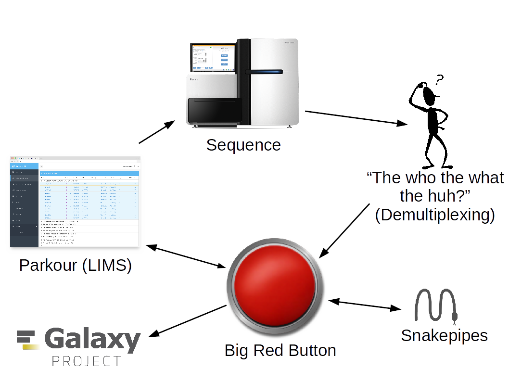

Push the button, you won't believe what will happen next.

Mundanity, managed

---

"The Big Red Button" is a program for automated analysis of demultiplexed datasets. It ties in with other solutions that we've created and use to provide a complete loop from sample submission to returned QC metrics.

The general steps of the `BigRedButton` pipeline (in python, the `BRB` or "be right back" module) are as follows:

1. Read in the configuration file (`~/BigRedButton.ini` and reimport the package).
2. Check for newly finished [demultiplexing runs](https://github.com/maxplanck-ie/TheWhoTheWhatTheHuh) (`BRB.findFinishedFlowcells()`). If there are none, then sleep.
3. For each newly demultiplexed run, contact Parkour to get the library types and organisms per library/sample.
4. Filter the Parkour results for what can currently be processed (see `~/BigRedButton.ini`).
5. Run an appropriate [Snakepipe](https://github.com/maxplanck-ie/snakepipes).
6. Link results into Galaxy (`BRB.galaxy.linkIntoGalaxy()`).
7. Send QC information back to Parkour (`BRB.ET.phoneHome()`).
8. Mark a flow cell as finished by touching `analysis.done`.

An analysis can be rerun by deleting `analysis.done` in the folder holding the demultiplexed results. The actual output is written only in the group directories (specifically, their `sequencing_data` directories).

The pipeline can be woken from sleep by sending it a `HUP` signal (e.g., `killall -HUP BigRedButton.py`).

The configuration file in the source directory should be copied to your home directory and modified to suite your needs (see the documentation in the file). Also, you should run `nohup BigRedButton.py &` to start the pipeline, so it continues after you log out.
